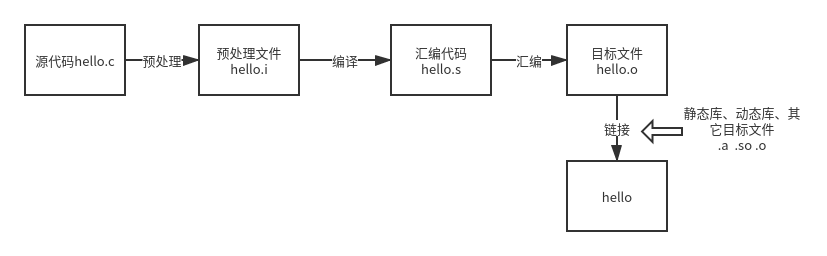

# GCC编译和链接过程



编译过程可分为1）预处理；2）编译；3）汇编；4）链接

## 准备

操作系统：Ubuntu20.04

gcc版本：9.3.0

待编译的程序代码

hello.c

```c
#include <stdbool.h>
#include <stdio.h>
#include "mymath.h"

#ifndef a
#define a b
#endif

int main() {
    // can't see me
    bool a = true;
    printf("hello %d", add(4, b));
    return 0;
}
```

mymath.h

```c
#ifndef STORAGE_MYMATH_H
#define STORAGE_MYMATH_H
int add(int a, int b);
#endif //STORAGE_MYMATH_H
```

mymath.c

```c
#include "mymath.h"

int add(int a, int b) {
    return a + b;
}
```

## 预处理

主要进行宏替换，编译命令为

```bash
gcc -E hello.c -o hello.i
gcc -E mymath.c -o mymath.i
```

## 编译

将.i文件编译成汇编文件.s，编译命令为

```bash
gcc -S hello.i -o hello.s
gcc -S mymath.i -o mymath.s
```

## 汇编

将汇编文件.s转为二进制文件，汇编命令为

```bash
gcc -c hello.s -o hello.o
gcc -c mymath.s -o mymath.o
```

可使用xxd或od命令查看二进制文件

## 链接

### 链接其它目标文件

```bash
gcc hello.o mymath.o -o hello1
```

### 链接动态库

gcc生成.so文件

```bash
gcc -fPIC -shared mymath.c -o libmymath.so
gcc hello.o -L. -lmymath -o hello3 -Wl,-rpath=./
```

链接动态库生成的可执行文件大小较小。删除动态库后程序无法运行。

### 链接静态库

ar命令生成.a文件

```bash
ar -r libmymath.a mymath.o
```

链接静态库

``` bash
gcc hello.o libmymath.a -o hello2
```

所有的库均静态链接，生成的可执行文件较大

```bash
gcc hello.o -L. -lmymath -static -o hello2
```

## 直接从源代码编译链接

```bash
gcc hello.c mymath.c -o hello5
gcc hello.c libmymath.a -o hello6
gcc hello.c -L. -lmymath -o hello3 -Wl,-rpath=./
gcc hello.c -L. -lmymath -static -o hello2
```

